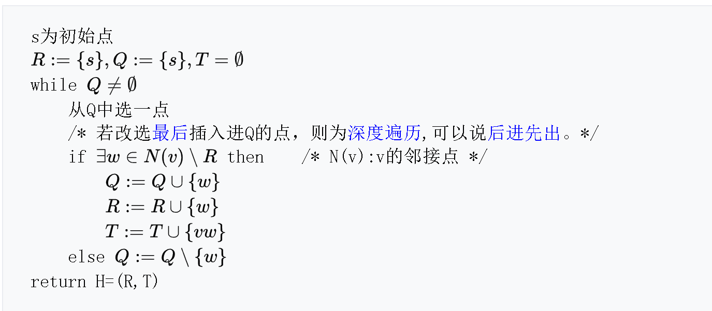

# BFS广度优先搜索

### 作法

BFS是一种[盲目搜索法](https://zh.wikipedia.org/w/index.php?title=%E7%9B%B2%E7%9B%AE%E6%90%9C%E5%B0%8B%E6%B3%95&action=edit&redlink=1)，目的是系统地展开并检查[图](https://zh.wikipedia.org/wiki/%E5%9B%BE)中的所有节点，以找寻结果。换句话说，它并不考虑结果的可能地址，彻底地搜索整张图，直到找到结果为止。BFS并不使用[经验法则算法](https://zh.wikipedia.org/wiki/%E5%90%AF%E5%8F%91%E5%BC%8F%E6%90%9C%E7%B4%A2)。

从算法的观点，所有因为展开节点而得到的子节点都会被加进一个[先进先出](https://zh.wikipedia.org/wiki/%E5%85%88%E9%80%B2%E5%85%88%E5%87%BA)的[队列](https://zh.wikipedia.org/wiki/%E9%98%9F%E5%88%97)中。一般的实现里，其邻居节点尚未被检验过的节点会被放置在一个被称为 open 的容器中（例如队列或是[链表](https://zh.wikipedia.org/wiki/%E9%80%A3%E7%B5%90%E4%B8%B2%E5%88%97)），而被检验过的节点则被放置在被称为 closed 的容器中。（open-closed表）

### 实现方法

1. 首先将根节点放入队列中。
2. 从队列中取出第一个节点，并检验它是否为目标。
   * 如果找到目标，则结束搜索并回传结果。
   * 否则将它所有尚未检验过的直接子节点加入队列中。
3. 若队列为空，表示整张图都检查过了——亦即图中没有欲搜索的目标。结束搜索并回传“找不到目标”。
4. 重复步骤2。



## C 的实例

```c
/*
    ADDQ (Q, p) - p PUSH 入 Q
    DELQ (Q) - POP Q 并返回 Q 顶
    FIRSTADJ (G,v) - v 的第一个邻接点，找不到则返回 -1
    NEXTADJ (G,v) - v 的下一个邻接点，找不到则返回 -1
    VISIT (v) - 访问 v
    visited [] - 是否已访问
*/

// 广度优先搜索算法
void BFS(VLink G[], int v) {
    int w;
    VISIT(v); // 访问 v 并入队
    visited[v] = 1;
    ADDQ(Q, v);
    // 对队列 Q 的各元素
    while (!EMPTYQ(Q)) {
        v = DELQ(Q);
        w = FIRSTADJ(G, v);
        do {
            // 进行访问和入队
            if (visited[w] == 0) {
                VISIT(w);
                ADDQ(Q, w);
                visited[w] = 1;
            }
        } while ((w = NEXTADJ(G, v)) != -1);
    }
}

// 对图G=(V,E)进行广度优先搜索的主算法
void TRAVEL_BFS(VLink G[], bool visited[], int n) {
    // 清零标记数组
    for (int i = 0; i < n; ++i)
        visited[i] = 0;
    for (int i = 0; i < n; ++i)
        if (visited[i] == 0)
            BFS(G, i);
}
```

## 特性

#### 空间复杂度\[[编辑](https://zh.wikipedia.org/w/index.php?title=%E5%B9%BF%E5%BA%A6%E4%BC%98%E5%85%88%E6%90%9C%E7%B4%A2&action=edit&section=6)\]

因为所有节点都必须被存储，因此BFS的空间复杂度为 O\(\|V\|+\|E\|\)，其中 \|V\|是节点的数目，而 \|E\|是图中边的数目。注：另一种说法称BFS的空间复杂度为O\(B^{M}\)，其中B是最大[分支系数](https://zh.wikipedia.org/wiki/%E5%88%86%E6%94%AF%E5%9B%A0%E5%AD%90)，而M是树的最长路径长度。由于对空间的大量需求，因此BFS并不适合解非常大的问题，对于类似的问题，应用[IDDFS](https://zh.wikipedia.org/wiki/%E8%BF%AD%E4%BB%A3%E6%B7%B1%E5%8C%96%E6%B7%B1%E5%BA%A6%E4%BC%98%E5%85%88%E6%90%9C%E7%B4%A2)以达节省空间的效果。

#### 时间复杂度\[[编辑](https://zh.wikipedia.org/w/index.php?title=%E5%B9%BF%E5%BA%A6%E4%BC%98%E5%85%88%E6%90%9C%E7%B4%A2&action=edit&section=7)\]

最差情形下，BFS必须查找所有到可能节点的所有路径，因此其时间复杂度为 O\(\|V\|+\|E\|\)，其中 \|V\|是节点的数目，而 \|E\|是图中边的数目。

#### 完全性\[[编辑](https://zh.wikipedia.org/w/index.php?title=%E5%B9%BF%E5%BA%A6%E4%BC%98%E5%85%88%E6%90%9C%E7%B4%A2&action=edit&section=8)\]

广度优先搜索算法具有完全性。这意指无论图形的种类如何，只要目标存在，则BFS一定会找到。然而，若目标不存在，且图为无限大，则BFS将不收敛（不会结束）。

#### 最佳解\[[编辑](https://zh.wikipedia.org/w/index.php?title=%E5%B9%BF%E5%BA%A6%E4%BC%98%E5%85%88%E6%90%9C%E7%B4%A2&action=edit&section=9)\]

若所有边的长度相等，广度优先搜索算法是最佳解——亦即它找到的第一个解，距离根节点的边数目一定最少；但对一般的图来说，BFS并不一定回传最佳解。这是因为当图形为加权图（亦即各边长度不同）时，BFS仍然回传从根节点开始，经过边数目最少的解；而这个解距离根节点的距离不一定最短。这个问题可以使用考虑各边权值，BFS的改良算法[成本一致搜索法](https://zh.wikipedia.org/wiki/%E6%88%90%E6%9C%AC%E4%B8%80%E8%87%B4%E6%90%9C%E5%B0%8B%E6%B3%95)来解决。然而，若非加权图形，则所有边的长度相等，BFS就能找到最近的最佳解。

## 广度优先搜索算法的应用

广度优先搜索算法能用来解决图论中的许多问题，例如：

* 查找图中所有连接组件（Connected Component）。一个连接组件是图中的最大相连子图。
* 查找连接组件中的所有节点。
* 查找非加权图中任两点的最短路径。
* 测试一图是否为[二分图](https://zh.wikipedia.org/wiki/%E4%BA%8C%E5%88%86%E5%9C%96)。
* [（Reverse）Cuthill–McKee算法](https://zh.wikipedia.org/w/index.php?title=Cuthill-McKee%E6%BC%94%E7%AE%97%E6%B3%95&action=edit&redlink=1)

