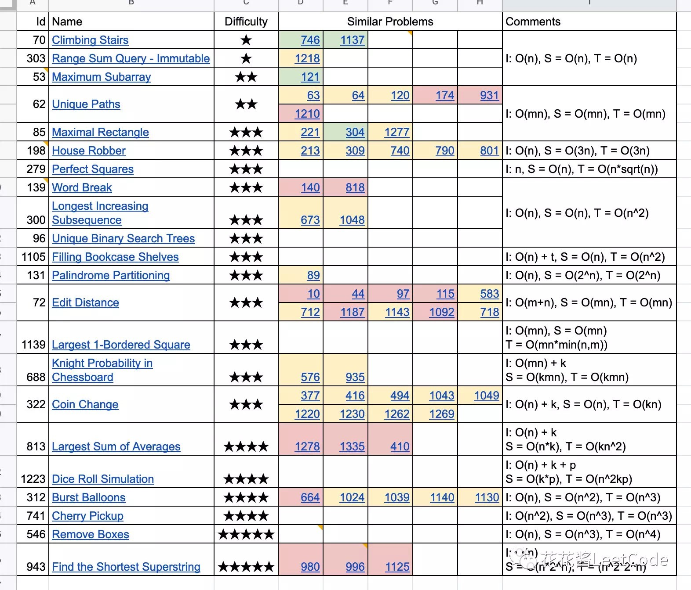

# DP动态规划

**动态规划**（英语：Dynamic programming，简称DP）是一种在[数学](https://zh.wikipedia.org/wiki/%E6%95%B0%E5%AD%A6)、[管理科学](https://zh.wikipedia.org/wiki/%E7%AE%A1%E7%90%86%E7%A7%91%E5%AD%A6)、[计算机科学](https://zh.wikipedia.org/wiki/%E8%AE%A1%E7%AE%97%E6%9C%BA%E7%A7%91%E5%AD%A6)、[经济学](https://zh.wikipedia.org/wiki/%E7%BB%8F%E6%B5%8E%E5%AD%A6)和[生物信息学](https://zh.wikipedia.org/wiki/%E7%94%9F%E7%89%A9%E4%BF%A1%E6%81%AF%E5%AD%A6)中使用的，通过把原问题分解为相对简单的子问题的方式求解复杂问题的方法。

动态规划常常适用于有重叠子问题[\[1\]](https://zh.wikipedia.org/wiki/%E5%8A%A8%E6%80%81%E8%A7%84%E5%88%92#cite_note-1)和[最优子结构](https://zh.wikipedia.org/w/index.php?title=%E6%9C%80%E4%BC%98%E5%AD%90%E7%BB%93%E6%9E%84&action=edit&redlink=1)性质的问题，动态规划方法所耗时间往往远少于朴素解法。

动态规划背后的基本思想非常简单。大致上，若要解一个给定问题，我们需要解其不同部分（即子问题），再根据子问题的解以得出原问题的解。

通常许多子问题非常相似，为此动态规划法试图仅仅解决每个子问题一次，从而减少计算量：一旦某个给定子问题的解已经算出，则将其[记忆化](https://zh.wikipedia.org/wiki/%E8%AE%B0%E5%BF%86%E5%8C%96)存储，以便下次需要同一个子问题解之时直接查表。这种做法在重复子问题的数目关于输入的规模呈[指数增长](https://zh.wikipedia.org/wiki/%E6%8C%87%E6%95%B8%E5%A2%9E%E9%95%B7)时特别有用。

### 概述

动态规划在查找有很多**重叠子问题**的情况的最优解时有效。它将问题重新组合成子问题。为了避免多次解决这些子问题，它们的结果都逐渐被计算并被保存，从简单的问题直到整个问题都被解决。因此，动态规划保存[递归](https://zh.wikipedia.org/wiki/%E9%80%92%E5%BD%92)时的结果，因而不会在解决同样的问题时花费时间。

动态规划只能应用于有**最优子结构**的问题。最优子结构的意思是局部最优解能决定全局最优解（对有些问题这个要求并不能完全满足，故有时需要引入一定的近似）。简单地说，问题能够分解成子问题来解决。

### 适用情况

1. 最优子结构性质。如果问题的最优解所包含的子问题的解也是最优的，我们就称该问题具有最优子结构性质（即满足最优化原理）。最优子结构性质为动态规划算法解决问题提供了重要线索。
2. 无后效性。即子问题的解一旦确定，就不再改变，不受在这之后、包含它的更大的问题的求解决策影响。
3. 子问题重叠性质。子问题重叠性质是指在用递归算法自顶向下对问题进行求解时，每次产生的子问题并不总是新问题，有些子问题会被重复计算多次。动态规划算法正是利用了这种子问题的重叠性质，对每一个子问题只计算一次，然后将其计算结果保存在一个表格中，当再次需要计算已经计算过的子问题时，只是在表格中简单地查看一下结果，从而获得较高的效率。

## 实例

**背包问题**

[背包问题](https://zh.wikipedia.org/wiki/%E8%83%8C%E5%8C%85%E9%97%AE%E9%A2%98)作为[NP完全](https://zh.wikipedia.org/wiki/NP%E5%AE%8C%E5%85%A8)问题，暂时不存在[多项式时间算法](https://zh.wikipedia.org/wiki/%E5%A4%9A%E9%A0%85%E5%BC%8F%E6%99%82%E9%96%93)。动态规划属于背包问题求解最优解的可行方法之一。此外，求解背包问题最优解还有搜索法等，近似解还有[贪心法](https://zh.wikipedia.org/wiki/%E8%B4%AA%E5%BF%83%E6%B3%95)等，分数背包问题有最优贪心解等。 背包问题具有最优子结构和重叠子问题。动态规划一般用于求解背包问题中的整数背包问题（即每种物品所选的个数必须是整数）。 解整数背包问题： 设有件物品，每件价值记为，每件体积记为，用一个最大容积为的背包，求装入物品的最大价值。 用一个数组![{\displaystyle f\[i,v\]}](https://wikimedia.org/api/rest_v1/media/math/render/svg/3e7902b9ed73afc6f07f04f74ba5cb2d7b4b3fd7)表示取件商品填充一个容积为v的背包的最大价值，显然问题的解就是![{\displaystyle f\[n,V\_{\text{max}}\]}](https://wikimedia.org/api/rest_v1/media/math/render/svg/850b012cc35dcc798a549e5675d3214c374de84f)。

对于特例0 1背包问题（即每件物品最多放1件，否则不放入）的问题，状态转移方程：

 参考[C++](https://zh.wikipedia.org/wiki/C%2B%2B)代码（不含include和数组声明）

```cpp
#define max(x,y) (x)>(y)?(x):(y) //max宏函数，也可以自己写或者调取algorithm
for(int i=1;i<=n;i++)
  for (v=totv;v>=v[i];v--)
    f[v]=max(f[v],f[v-v[i]]+p[i]);
printf("%d",f[totv]); //或std:cout<<f[totv];
```

## 使用动态规划的算法

* [最长公共子序列](https://zh.wikipedia.org/wiki/%E6%9C%80%E9%95%BF%E5%85%AC%E5%85%B1%E5%AD%90%E5%BA%8F%E5%88%97)
* [Floyd-Warshall算法](https://zh.wikipedia.org/wiki/Floyd-Warshall%E7%AE%97%E6%B3%95)
* [Viterbi算法](https://zh.wikipedia.org/wiki/%E7%BB%B4%E7%89%B9%E6%AF%94%E7%AE%97%E6%B3%95)

以下leetcode题目表格来自 花花酱 的视频截图



