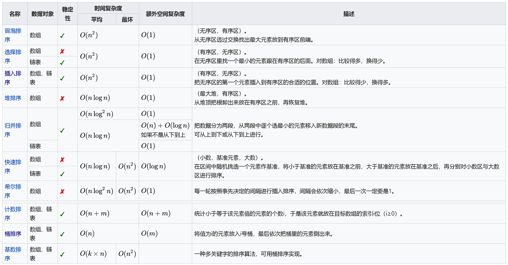

# Sort 排序算法

### 排序算法列表

#### 稳定的排序

* 冒泡排序（bubble sort） - O\(N^2\)

```python
import random


def bubble_sort(seq):  # O(n^2), n(n-1)/2 = 1/2(n^2 + n)
    n = len(seq)
    for i in range(n-1):
        print(seq)    # 我打印出来让你看清楚每一轮最高、次高、次次高...的小朋友会冒泡到右边
        for j in range(n-1-i):  # 这里之所以 n-1 还需要 减去 i 是因为每一轮冒泡最大的元素都会冒泡到最后，无需再比较
            if seq[j] > seq[j+1]:
                seq[j], seq[j+1] = seq[j+1], seq[j]
	print(seq)


def test_bubble_sort():
    seq = list(range(10))  # 注意 python3 返回迭代器，所以我都用 list 强转了，python2 range 返回的就是 list
    random.shuffle(seq)   # shuffle inplace 操作，打乱数组
    bubble_sort(seq)
    assert seq == sorted(seq)  # 注意呦，内置的 sorted 就不是 inplace 的，它返回一个新的数组，不影响传入的参数

""" 我打印出来让你看到每次从最高到次高的小盆友就这么排好序了，因为是随机数，你第一个没有排序的数组应该和我的不一样
[3, 4, 5, 0, 9, 1, 7, 8, 6, 2]
[3, 4, 0, 5, 1, 7, 8, 6, 2, 9]
[3, 0, 4, 1, 5, 7, 6, 2, 8, 9]
[0, 3, 1, 4, 5, 6, 2, 7, 8, 9]
[0, 1, 3, 4, 5, 2, 6, 7, 8, 9]
[0, 1, 3, 4, 2, 5, 6, 7, 8, 9]
[0, 1, 3, 2, 4, 5, 6, 7, 8, 9]
[0, 1, 2, 3, 4, 5, 6, 7, 8, 9]
[0, 1, 2, 3, 4, 5, 6, 7, 8, 9]
[0, 1, 2, 3, 4, 5, 6, 7, 8, 9]
"""
```

* 插入排序（insertion sort）- O\(N^2\)

```python
def insertion_sort(seq):
    """ 每次挑选下一个元素插入已经排序的数组中,初始时已排序数组只有一个元素"""
    n = len(seq)
    print(seq)
    for i in range(1, n):
        value = seq[i]    # 保存当前位置的值，因为转移的过程中它的位置可能被覆盖
        # 找到这个值的合适位置，使得前边的数组有序 [0,i] 有序
        pos = i
        while pos > 0 and value < seq[pos-1]:
            seq[pos] = seq[pos-1]  # 如果前边的元素比它大，就让它一直前移
            pos -= 1
        seq[pos] = value    # 找到了合适的位置赋值就好
        print(seq)


""" 不断把新元素放到已经有序的数组中
[1, 7, 3, 0, 9, 4, 8, 2, 6, 5]
[1, 7, 3, 0, 9, 4, 8, 2, 6, 5]
[1, 3, 7, 0, 9, 4, 8, 2, 6, 5]
[0, 1, 3, 7, 9, 4, 8, 2, 6, 5]
[0, 1, 3, 7, 9, 4, 8, 2, 6, 5]
[0, 1, 3, 4, 7, 9, 8, 2, 6, 5]
[0, 1, 3, 4, 7, 8, 9, 2, 6, 5]
[0, 1, 2, 3, 4, 7, 8, 9, 6, 5]
[0, 1, 2, 3, 4, 6, 7, 8, 9, 5]
[0, 1, 2, 3, 4, 5, 6, 7, 8, 9]
"""
```

* 桶排序（bucket sort）—O\(n\)；需要O\(k\)额外空间
* 计数排序（counting sort）—O\(n+k\)；需要O\(n+k\)额外空间
* 归并排序（merge sort）—O\(logN\)；需要O\(n+k\)额外空间

```python
def merge_sort(seq):
    if len(seq) <= 1:   # 只有一个元素是递归出口
        return seq
    else:
        mid = int(len(seq)/2)
        left_half = merge_sort(seq[:mid])
        right_half = merge_sort(seq[mid:])

        # 合并两个有序的数组
        new_seq = merge_sorted_list(left_half, right_half)
        return new_seq
def merge_sorted_list(sorted_a, sorted_b):
    """ 合并两个有序序列，返回一个新的有序序列

    :param sorted_a:
    :param sorted_b:
    """
    length_a, length_b = len(sorted_a), len(sorted_b)
    a = b = 0
    new_sorted_seq = list()

    while a < length_a and b < length_b:
        if sorted_a[a] < sorted_b[b]:
            new_sorted_seq.append(sorted_a[a])
            a += 1
        else:
            new_sorted_seq.append(sorted_b[b])
            b += 1

    # 最后别忘记把多余的都放到有序数组里
    if a < length_a:
        new_sorted_seq.extend(sorted_a[a:])
    else:
        new_sorted_seq.extend(sorted_b[b:])

    return new_sorted_seq
```

#### 不稳定的排序

* 选择排序（selection sort）—O\(n^2\)

```python
def select_sort(seq):
    n = len(seq)
    for i in range(n-1):
        min_idx = i    # 我们假设当前下标的元素是最小的
        for j in range(i+1, n):    # 从 i 的后边开始找到最小的元素，得到它的下标
            if seq[j] < seq[min_idx]:
                min_idx = j    # 一个 j 循环下来之后就找到了最小的元素它的下标
        if min_idx != i:    # swap
            seq[i], seq[min_idx] = seq[min_idx], seq[i]


def test_select_sort():
    seq = list(range(10))
    random.shuffle(seq)
    select_sort(seq)
    assert seq == sorted(seq)

"""
[4, 7, 5, 3, 6, 0, 2, 9, 8, 1]
[0, 7, 5, 3, 6, 4, 2, 9, 8, 1]
[0, 1, 5, 3, 6, 4, 2, 9, 8, 7]
[0, 1, 2, 3, 6, 4, 5, 9, 8, 7]
[0, 1, 2, 3, 6, 4, 5, 9, 8, 7]
[0, 1, 2, 3, 4, 6, 5, 9, 8, 7]
[0, 1, 2, 3, 4, 5, 6, 9, 8, 7]
[0, 1, 2, 3, 4, 5, 6, 9, 8, 7]
[0, 1, 2, 3, 4, 5, 6, 7, 8, 9]
[0, 1, 2, 3, 4, 5, 6, 7, 8, 9]

"""
```

* 希尔排序（shell sort）—O\(logN^2\)如果使用最佳的现在版本
* 堆排序（heap sort）—O\(nlogN\)
* 快速排序（quick sort）—O\(nlogN\)期望时间，O\(N^2\)最坏情况；对于大的、随机数列表一般相信是最快的已知排序

```python
def quicksort_inplace(array, beg, end):    
# 注意这里我们都用左闭右开区间，end 传入 len(array)
    if beg < end:    # beg == end 的时候递归出口
        pivot = partition(array, beg, end)
        quicksort_inplace(array, beg, pivot)
        quicksort_inplace(array, pivot+1, end)
def partition(array, beg, end):
    pivot_index = beg
    pivot = array[pivot_index]
    left = pivot_index + 1
    right = end - 1    # 开区间，最后一个元素位置是 end-1     [0, end-1] or [0: end)，括号表示开区间

    while True:
        # 从左边找到比 pivot 大的
        while left <= right and array[left] < pivot:
            left += 1

        while right >= left and array[right] >= pivot:
            right -= 1

        if left > right:
            break
        else:
            array[left], array[right] = array[right], array[left]

    array[pivot_index], array[right] = array[right], array[pivot_index]
    return right   # 新的 pivot 位置      
```


### 简要比较


| 排序算法 | 最差时间分析 | 平均时间复杂度 | 稳定度 | 空间复杂度 |
| :--- | :--- | :--- | :--- | :--- |
| 冒泡排序 | O\(n^2\) | O\(n^2\) | 稳定 | O\(1\) |
| 选择排序 | O\(n^2\) | O\(n^2\) | 不稳定 | O\(1\) |
| 插入排序 | O\(n^2\) | O\(n^2\) | 稳定 | O\(1\) |
| 二叉树排序 | O\(n^2\) | O\(n\*log2n\) | 不稳定 | O\(n\) |
| 快速排序 | O\(n^2\) | O\(n\*log2n\) | 不稳定 | O\(log2n\)~O\(n\) |
| 堆排序 | O\(n\*log2n\) | O\(n\*log2n\) | 不稳定 | O\(1\) |



* 均按从小到大排列
* k代表数值中的"数位"个数
* n代表数据规模
* m代表数据的最大值减最小值


