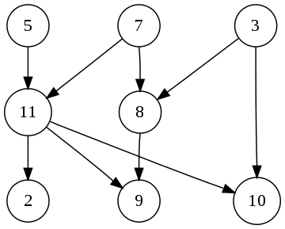

# 拓补排序

在[计算机科学](https://zh.wikipedia.org/wiki/%E8%AE%A1%E7%AE%97%E6%9C%BA%E7%A7%91%E5%AD%A6)领域，有向图的拓扑排序是其顶点的线性排序，使得对于从顶点到顶点的每个[有向边](https://zh.wikipedia.org/wiki/%E6%9C%89%E5%90%91%E8%BE%B9)，在排序中都在之前。

例如，图形的顶点可以表示要执行的任务，并且边可以表示一个任务必须在另一个任务之前执行的约束；在这个应用中，拓扑排序只是一个有效的任务顺序。

当且仅当图中没有定向环时（即[有向无环图](https://zh.wikipedia.org/wiki/%E6%9C%89%E5%90%91%E6%97%A0%E7%8E%AF%E5%9B%BE)），才有可能进行拓扑排序。

任何有向无环图至少有一个拓扑排序。已知有算法可以在线性时间内，构建任何有向无环图的拓扑排序。

在[图论](https://zh.wikipedia.org/wiki/%E5%9B%BE%E8%AE%BA)中，由一个[有向无环图](https://zh.wikipedia.org/wiki/%E6%9C%89%E5%90%91%E6%97%A0%E7%8E%AF%E5%9B%BE)的顶点组成的序列，当且仅当满足下列条件时，才能称为该[图](https://zh.wikipedia.org/wiki/%E5%9B%BE)的一个**拓扑排序**（英语：Topological sorting）：

1. 序列中包含每个顶点，且每个顶点只出现一次；
2. 若A在序列中排在B的前面，则在图中不存在从B到A的[路径](https://zh.wikipedia.org/wiki/%E8%B7%AF%E5%BE%84_%28%E5%9B%BE%E8%AE%BA%29)。



 上图有许多合理的拓补排序:

* 5, 7, 3, 11, 8, 2, 9, 10 \(visual left-to-right, top-to-bottom\)
* 3, 5, 7, 8, 11, 2, 9, 10 \(smallest-numbered available vertex first\)
* 5, 7, 3, 8, 11, 10, 9, 2 \(fewest edges first\)
* 7, 5, 11, 3, 10, 8, 9, 2 \(largest-numbered available vertex first\)
* 5, 7, 11, 2, 3, 8, 9, 10 \(attempting top-to-bottom, left-to-right\)
* 3, 7, 8, 5, 11, 10, 2, 9 \(arbitrary\)

### 算法

#### 卡恩算法

卡恩于1962年提出了该算法。简单来说，假设L是存放结果的列表，先找到那些入度为零的节点，把这些节点放到L中，因为这些节点没有任何的父节点。然后把与这些节点相连的边从图中去掉，再寻找图中的入度为零的节点。对于新找到的这些入度为零的节点来说，他们的父节点已经都在L中了，所以也可以放入L。重复上述操作，直到找不到入度为零的节点。如果此时L中的元素个数和节点总数相同，说明排序完成；如果L中的元素个数和节点总数不同，说明原图中存在环，无法进行拓扑排序。

```kotlin
L ← Empty list that will contain the sorted elements
S ← Set of all nodes with no incoming edge

while S is not empty do
    remove a node n from S
    add n to tail of L
    for each node m with an edge e from n to m do
        remove edge e from the graph
        if m has no other incoming edges then
            insert m into S

if graph has edges then
    return error   (graph has at least one cycle)
else 
    return L   (a topologically sorted order)
```

#### 深度优先搜索

另一种拓扑排序的方法运用了深度优先搜索。深度优先搜索以任意顺序循环遍历图中的每个节点。若搜索进行中碰到之前已经遇到的节点，或碰到叶节点，则中止算法。

```kotlin
L ← Empty list that will contain the sorted nodes
while exists nodes without a permanent mark do
    select an unmarked node n
    visit(n)

function visit(node n)
    if n has a permanent mark then
        return
    if n has a temporary mark then
        stop   (not a DAG)

    mark n with a temporary mark

    for each node m with an edge from n to m do
        visit(m)

    remove temporary mark from n
    mark n with a permanent mark
    add n to head of L
```

#### Parallel algorithm \[并行算法\]

维基百科对这种拓补排序的解释有点复杂，就不搬运了。

[https://en.wikipedia.org/wiki/Topological\_sorting](https://en.wikipedia.org/wiki/Topological_sorting)

### 相关例题

LeetCode 269, Alien Dictionary 外星词典.

