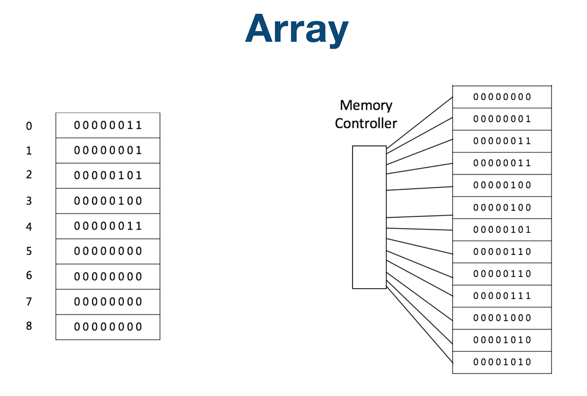

# Array数组

## 数组

在计算机科学中，**数组数据结构**（英语：array data structure），简称**数组**（英语：Array），是由相同类型的元素（element）的集合所组成的[数据结构](https://zh.wikipedia.org/wiki/%E6%95%B0%E6%8D%AE%E7%BB%93%E6%9E%84)，分配一块连续的内存来存储。利用元素的索引（index）可以计算出该元素对应的存储地址。

最简单的数据结构类型是**一维数组**。例如，索引为0到9的32位整数数组，可作为在存储器地址2000，2004，2008，...2036中，存储10个变量，因此索引为i的元素即在存储器中的2000+4×i地址。数组第一个元素的存储器地址称为第一地址或基础地址。

**二维数组**，对应于数学上的[矩阵](https://zh.wikipedia.org/wiki/%E7%9F%A9%E9%99%A3)概念，可表示为二维矩形格。例如：

在[C语言](https://zh.wikipedia.org/wiki/C%E8%AF%AD%E8%A8%80)中表示为\`int a\[3\]\[3\] = ;

## 链表

